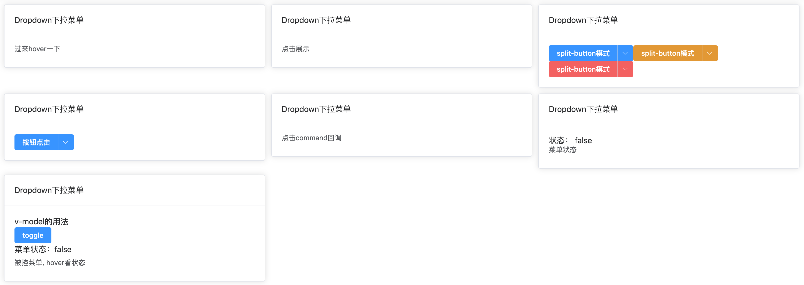

# 下拉菜单

下拉菜单组件功能特点：

- 整合`element-plus`中的`el-dropdown`组件进阶更多用法

## 效果


## 基础用法

```typescript
<template>
  <div class="p-4 grid grid-cols-3 gap-3">
    <t-card header="Dropdown下拉菜单">
      <drop-down :actions="actions" trigger="hover">过来hover一下</drop-down>
    </t-card>
    <t-card header="Dropdown下拉菜单">
      <drop-down :actions="actions" trigger="click">点击展示</drop-down>
    </t-card>
    <t-card header="Dropdown下拉菜单">
      <drop-down split-button type="primary" :actions="actions" trigger="hover"
        >split-button模式</drop-down
      >
      <drop-down split-button type="warning" :actions="actions" trigger="hover"
        >split-button模式</drop-down
      >
      <drop-down split-button type="danger" :actions="actions" trigger="hover"
        >split-button模式</drop-down
      >
    </t-card>
    <t-card header="Dropdown下拉菜单">
      <drop-down split-button type="primary" :actions="actions" trigger="hover">按钮点击</drop-down>
    </t-card>
    <t-card header="Dropdown下拉菜单">
      <drop-down :actions="actions" trigger="hover" @command="handleCommand"
        >点击command回调</drop-down
      >
    </t-card>
    <t-card header="Dropdown下拉菜单">
      <div>状态： {{ status }}</div>
      <drop-down :actions="actions" trigger="hover" @visible-change="handleVisibleChange"
        >菜单状态</drop-down
      >
    </t-card>
    <t-card header="Dropdown下拉菜单">
      <div>v-model的用法</div>
      <el-button type="primary" @click="toggle">toggle</el-button>
      <div class="pb-2">菜单状态：{{ show }}</div>
      <drop-down v-model="show" :actions="actions" trigger="hover">被控菜单, hover看状态</drop-down>
    </t-card>
  </div>
</template>

<script lang="ts">
  import { defineComponent } from 'vue'
  import { localeList } from '@/settings/localeSetting'
  import { ElMessage } from 'element-plus'

  export default defineComponent({
    setup() {
      const actions = localeList
      const status = ref(false)
      const [show, toggle] = useToggle<any>(false)
      actions.push(
        ...[
          {
            text: '选项1-禁用',
            value: 1,
            disabled: true
          },
          {
            text: '选项2-分段',
            value: 1,
            divider: true
          },
          {
            text: '选项click事件',
            value: 2,
            click: (item, index) => ElMessage.success(`点击了${item.text}, 第${index}个`)
          }
        ]
      )

      function handleCommand(command) {
        ElMessage.success(`点击了${command}`)
      }

      function handleVisibleChange(val) {
        status.value = val
      }

      return {
        actions,
        handleCommand,
        handleVisibleChange,
        status,
        show,
        toggle
      }
    }
  })
</script>
```

## 属性

| 属性       | 描述             | 类型    | 可选值 | 默认值 |
| :--------- | :--------------- | :------ | :----- | :----- |
| modelValue      |        | boolean  | —      |  false      |
| type | 菜单按钮类型   | string  | —      | -       |
| splitButton    | 呈现为按钮组模式 | boolean | —      | false  |
| actions    |  | array | —      | -  |
| size    | 菜单尺寸 | string | large｜default｜small      | default  |
| trigger    | 触发下拉的行为 | string | click｜hover｜contextmenu   | click  |
| placement    | 菜单弹出位置 | string | —      | false  |
| maxHeight    | 菜单最大高度 | number｜string | —      | false  |
| current    |  | number｜string | —      | false  |

[其他属性可参考element-plus官网](https://element-plus.org/zh-CN/component/dropdown.html)

## 事件


| 事件名 | 说明                                               | 参数            |
| :----- | :------------------------------------------------- | :-------------- |
| command | 点击菜单项触发的事件回调 | dropdown-item 的指令 |
| click  | split-button 为 true 时，点击左侧按钮的回调 | - |
| visible-change  | 下拉框出现/隐藏时触发 | 出现则为 true，隐藏则为 false |
| update:modelValue  |  | - |
| update:current  |  | - |