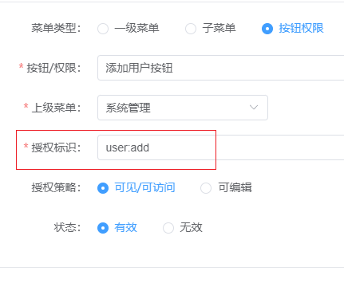

# 页面按钮权限用法

1.后台进入菜单管理页面配置按钮权限菜单

 

2.进入角色管理授权按钮（授权后即可看见按钮）


备注： 授权标识支持多个，多个逗号分隔

3.按钮显示隐藏可通过函数和指令2种方式进行控制

```js
import { usePermission } from '/@/hooks/web/usePermission';
const { hasPermission } = usePermission();
```

```html
<!-- 函数方式(hasPermission) user:add 为后台添加的权限编码 --> 
<el-button @click="handleAdd" v-has="'user:add'" type="primary" icon="plus">添加用户</el-button>

<!-- 指令方式(v-auth) user:add 为后台添加的权限编码 -->
<el-button @click="handleAdd" v-if="hasPermission('user:add')" type="primary" icon="plus">添加用户</el-button>
```

4.操作列(TableAction)按钮显示隐藏控制

```html 
{
  label: '编辑',
  onClick: handleEdit.bind(null, record),
  auth: 'other', // 根据权限控制是否显示: 无权限，不显示
},
{
  label: '删除',
  icon: 'ic:outline-delete-outline',
  onClick: handleDelete.bind(null, record),
  auth: 'user:add', // 根据权限控制是否显示: 有权限，会显示
}, 
```


