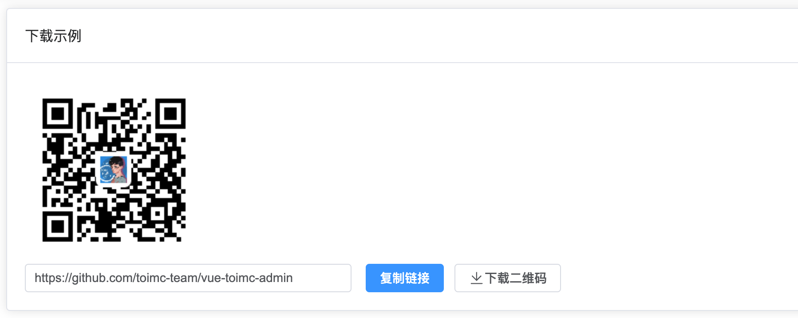

# 复制

使用useClipboard函数扩展复制功能
## 效果


## 基础用法

```typescript
<template>
  <div class="p-4">
    <el-card>
      <template #header>
        <div class="flex items-center">
          <span class="mr-4">下载示例</span>
        </div>
      </template>
      <qr-code ref="qrRef" :value="url" :logo="logoImg"></qr-code>

      <el-row>
        <div class="w-96 pr-4">
          <el-input
            v-model="url"
            clearable
            placeholder="输入链接地址..."
            @input="(val) => (url = val)"
          ></el-input>
        </div>
        <el-button type="primary" @click="() => copyText(url)">复制链接</el-button>
        <el-tooltip content="(在线logo会导致图片跨域，需要下载图片需要自行解决跨域问题)">
          <el-button @click="download">
            <icon :size="18" class="cursor-pointer" icon="ep:download"></icon>下载二维码
          </el-button>
        </el-tooltip>
      </el-row>
    </el-card>
  </div>
</template>

<script lang="ts">
  import { defineComponent } from 'vue'
  import logoImg from '@/assets/images/brian.jpg'
  import { QrCodeActionType } from '@/components/QrCode/types'
  import { ElMessage } from 'element-plus'

  export default defineComponent({
    setup() {
      const url = ref('https://github.com/toimc-team/vue-toimc-admin')
      const qrRef = ref<Nullable<QrCodeActionType>>(null)

      function download() {
        const qrEl = unref(qrRef)
        if (!qrEl) return
        qrEl.download('文件名')
      }

      function copyText(val) {
        const { copy } = useClipboard()
        copy(val)
        ElMessage.success('复制成功')
      }

      return {
        qrRef,
        url,
        logoImg,
        download,
        copyText
      }
    }
  })
</script>
```
