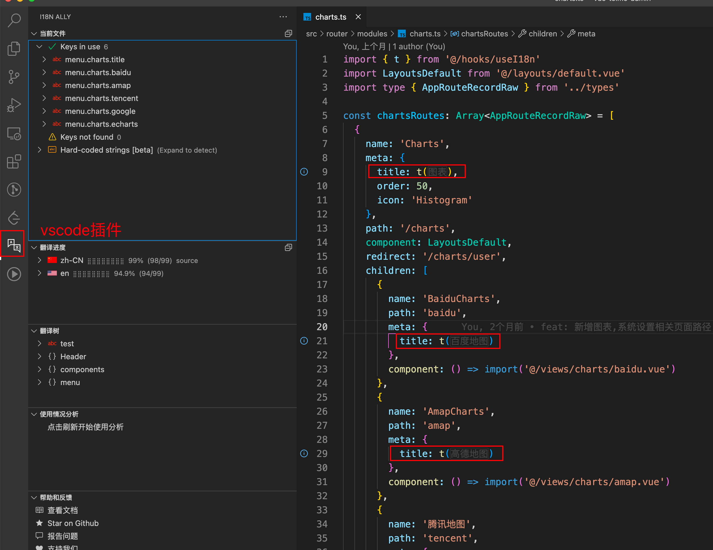

# 路由

项目路由配置存放于`src/router`下面。 `src/router/modules`用于存放路由模块，在该目录下的文件会自动注册。

## 配置

### 模块说明

在`src/router/modules`内的`.ts`文件会被视为一个路由模块。

一个路由模块包括以下结构，这里以`about`模块的路由为例

```ts
import { t } from '@/hooks/useI18n'
import LayoutsDefault from '@/layouts/default.vue'
import type { AppRouteRecordRaw } from '../types'

const aboutRoutes: Array<AppRouteRecordRaw> = [
  {
    name: 'About',
    meta: {
      title: t('menu.about.title'),
      order: 100000,
      icon: 'InfoFilled',
      hideChildrenInMenu: true,
      alone: true
    },
    path: '/about',
    component: LayoutsDefault,
    redirect: '/about/index',
    children: [
      {
        name: 'AboutPage',
        path: 'index',
        meta: {
          title: t('menu.about.about-us')
        },
        component: () => import('@/views/about/index.vue')
      }
    ]
  }
]

export default aboutRoutes
```

### 多级路由

> **注意事项：**
>
> 整个项目所有路由 `name` 不能重复
>
> 所有的多级路由最终都会转成二级路由，所以不能内嵌子路由
>
> 除了 `layout` 对应的 `path` 前面需要加 `/`，其余子路由都不要以`/`开头

```ts
import { t } from '@/hooks/useI18n'
import LayoutsDefault from '@/layouts/default.vue'
import type { AppRouteRecordRaw } from '../types'

const componentsRoutes: Array<AppRouteRecordRaw> = [
  {
    name: 'MenusDemo',
    meta: {
      title: t('menu.nest-menus.title'),
      order: 70,
      icon: 'Guide'
    },
    path: '/menus',
    component: LayoutsDefault,
    redirect: '/menus/menu',
    children: [
      {
        name: 'Menus1',
        path: 'menu',
        meta: {
          title: t('menu.nest-menus.menu1')
        },
        component: () => import('@/views/menus/menu1.vue'),
        children: [
          {
            name: 'Menu1-1',
            path: 'menu1-1',
            component: () => import('@/views/menus/menu1-1.vue'),
            meta: {
              title: t('menu.nest-menus.menu1-1')
            },
            children: [
              {
                name: 'Menu1-1-1',
                path: 'menu1-1-1',
                component: () => import('@/views/menus/menu1-1-1.vue'),
                meta: {
                  title: t('menu.nest-menus.menu1-1-1')
                }
              }
            ]
          },
          {
            name: 'Menus1-2',
            path: 'menu1-2',
            component: () => import('@/views/menus/menu1-2.vue'),
            meta: {
              title: t('menu.nest-menus.menu1-2')
            }
          }
        ]
      },
      {
        name: 'Menus2',
        path: 'menu2',
        meta: {
          title: t('menu.nest-menus.menu2')
        },
        component: () => import('@/views/menus/menu2.vue')
      }
    ]
  }
]

export default componentsRoutes
```

### Meta 配置说明

```ts
interface RouteMeta extends Record<string | number | symbol, unknown> {
  order?: number
  // 标题
  title: string
  // 是否隐藏二级菜单
  hideChildrenInMenu?: boolean
  // 是否独立展示
  alone?: boolean
  // 是否忽略权限
  ignoreAuth?: boolean
  // 角色信息
  roles?: RoleEnum[]
  // 是否缓存
  ignoreKeepAlive?: boolean
  // 图标
  icon?: string
  // 链接
  frameSrc?: string
  // 当前路由不再菜单显示
  hideMenu?: boolean
  // 隐藏该路由在面包屑上面的显示
  hideBreadcrumb?: boolean
}
```

### 外部页面嵌套

只需要将 `frameSrc` 设置为需要跳转的地址即可

完整示例可见`src/router/modules/iframe.ts`

```ts
{
  name: 'IframeIndex',
  path: 'iframe',
  component: () => import('@/views/iframe/index.vue'),
  meta: {
    title: t('menu.iframe.iframe'),
    frameSrc: 'https://toimc-team.github.io/notes-page/'
  }
},

```

### 外链

只需要将 `path` 设置为需要跳转的 HTTP 地址即可

```ts
{
  name: 'External',
  path: 'https://toimc-team.github.io/notes-page/',
  component: () => import('@/views/iframe/blank.vue'),
  meta: {
    title: t('menu.iframe.external')
  }
}
```

## 新增路由

### 新增路由

在 `src/router/modules` 内新增一个模块文件`test.ts`（建议：按照功能命名）。

::: tip

此时路由已添加完成，不需要手动引入，放在 `src/router/modules` 内的文件会自动被加载。

:::

```ts
import { t } from '@/hooks/useI18n'
import LayoutsDefault from '@/layouts/default.vue'
import type { AppRouteRecordRaw } from '../types'

const testRoutes: Array<AppRouteRecordRaw> = [
  {
    name: 'Test',
    meta: {
      title: 'Test',
      order: 100000,
      icon: 'Histogram',
      hideChildrenInMenu: true,
      alone: true
    },
    path: '/test',
    component: LayoutsDefault,
    redirect: '/test/index',
    children: [
      {
        name: 'TestPage',
        path: 'index',
        meta: {
          title: 'test page'
        },
        component: () => import('@/views/test/index.vue')
      }
    ]
  }
]

export default testRoutes

```


### 标题国际化

为了配合vscode的[i18n插件](https://marketplace.visualstudio.com/items?itemName=Lokalise.i18n-ally)，添加了一个“无意义”的方法：

```ts
import { t } from '@/hooks/useI18n'

// 文件内容
export const t = (key: string) => key
```

效果：

